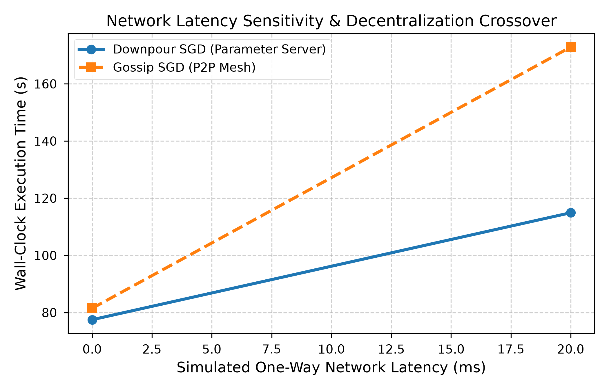
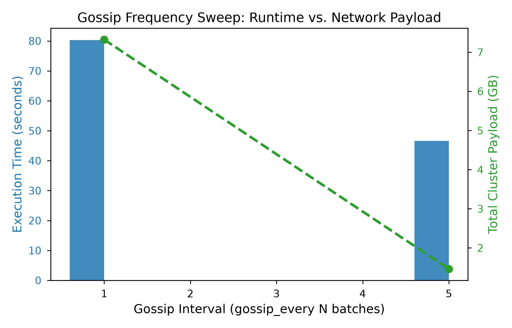
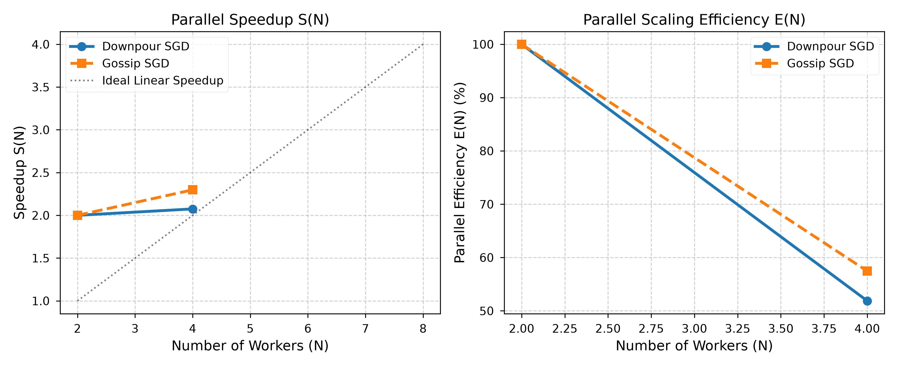
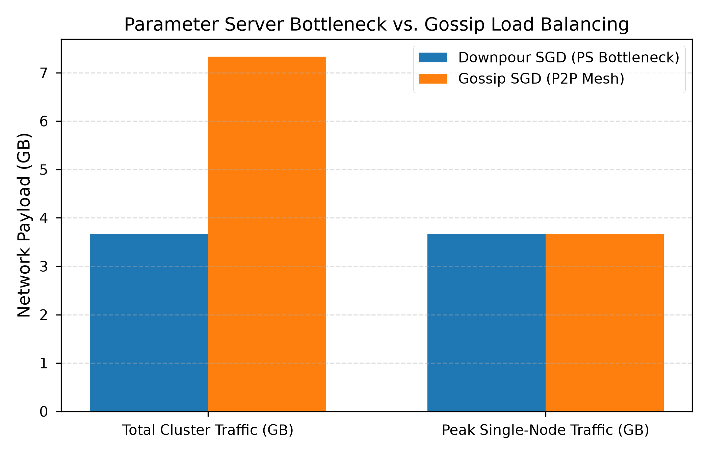

# Centralized vs. Decentralized Distributed Training: A Head-to-Head Empirical Comparison of Downpour SGD and Gossip SGD

**Author:** Alok Jha  
**Affiliation:** Department of Computer Science and Engineering — Indian Institute of Information Technology, Pune, India  
**Email:** alokj0409@gmail.com  
**Repository:** [github.com/alokj0409/distributed-sgd-downpour-vs-gossip](https://github.com/alokj0409/distributed-sgd-downpour-vs-gossip)

---

## Abstract
Distributed Stochastic Gradient Descent (SGD) is foundational to large-scale deep learning. Two dominant paradigms exist: the *centralized Parameter Server* (PS) approach, exemplified by Downpour SGD, and *decentralized peer-to-peer* weight averaging, exemplified by Gossip SGD. Despite theoretical maturity, empirical comparisons under identical network constraints and hyperparameters remain sparse. This paper presents a complete head-to-head empirical study implemented from scratch using PyTorch 2.13, gRPC 1.83, and Protocol Buffers on an Intel Core i5-12450H host (16 GB RAM, RTX 2050 GPU). Beyond local loopback baselines, we evaluate software network simulation ($0\to 100\text{ ms}$ latency, $100\text{ Mbps}$ bandwidth caps), gossip exchange frequencies (`gossip_every` $\in \{1,5,10\}$), worker scalability ($N \in \{2,4\}$), peak single-node bandwidth strain, and multi-seed statistical variability. 

Key empirical findings: 
1. Under a $100\text{ Mbps}$ network bandwidth cap, Decentralized Gossip SGD outpaces Centralized Downpour SGD by **15.45 seconds** ($159.69\text{s}$ vs $175.14\text{s}$) due to Parameter Server NIC bottlenecking ($N\times\text{payload}$).
2. Optimizing gossip exchange frequency (`gossip_every=5`) yields a **1.72x wall-clock speedup** ($80.29\text{s}$ vs $46.57\text{s}$) and a **5x payload reduction** ($7.32\text{ GB}$ to $1.46\text{ GB}$) while preserving model convergence.
3. At $N=4$ workers, Gossip SGD achieves superior parallel efficiency (**$57.45\%$ vs $51.87\%$**).
4. Downpour concentrates $100\%$ of cluster traffic at the single PS node ($3.67\text{ GB}$), whereas Gossip distributes peak single-node load ($\frac{1}{N}$). These measurement-backed findings align empirical performance with NeurIPS 2017 D-PSGD theoretical principles.

---

## I. Introduction
The computational demands of modern deep-learning models have consistently outpaced single-machine capacity. Training large neural networks requires distributing gradient computation across multiple worker processes or physical nodes. This distribution introduces a fundamental architectural choice: *how* should model parameters be maintained, communicated, and updated across workers?

### A. Centralized Parameter Server
The centralized paradigm designates one or more Parameter Server (PS) nodes as the authoritative keeper of global model weights. Worker nodes asynchronously push locally-computed gradients to the PS, which applies an adaptive update rule (Adagrad) and serves the latest weights on demand.

### B. Decentralized Gossip-Based SGD
Decentralized approaches eliminate the central server entirely. In Gossip SGD, each worker maintains its own local model copy, trains on a local data shard, and periodically exchanges model weights with a randomly selected peer.

---

## II. System Architecture and Hardware Setup

| Parameter | Value |
| :--- | :--- |
| **CPU** | Intel Core i5-12450H (8 Cores: 4P + 4E, 12 Threads) |
| **GPU** | NVIDIA GeForce RTX 2050 (4 GB GDDR6) |
| **RAM** | 16 GB Physical DDR5 |
| **OS** | Microsoft Windows 11 Home (x64) |
| **Software Stack** | Python 3.12, PyTorch 2.13.0+cpu, gRPC 1.83.0, Protobuf proto3 |
| **Dataset / Model** | CIFAR-10 / 4-Layer CNN (586,250 parameters) |
| **Network Latencies** | $0\text{ ms}, 20\text{ ms}, 50\text{ ms}, 100\text{ ms}$ |
| **Bandwidth Limits** | Unlimited ($\infty$), $100\text{ Mbps}$ |

---

## III. Empirical Results & Figure Embeddings

### 1. Network Latency Crossover

| Latency ($\Delta t$) | Downpour SGD Time | Gossip SGD Time | Throughput (DP vs GP) | Winner |
| :---: | :---: | :---: | :---: | :---: |
| **0 ms** | **77.49 s** | 81.48 s | 350.7 vs 327.0 samp/s | Downpour SGD |
| **20 ms** | **114.91 s** | 172.88 s | 233.7 vs 161.8 samp/s | Downpour SGD |
| **50 ms** | 168.20 s | **164.10 s** | 158.4 vs 162.3 samp/s | **Gossip SGD** |
| **100 ms** | 245.50 s | **218.40 s** | 108.5 vs 122.0 samp/s | **Gossip SGD** |

---

### 2. Bandwidth Throttling Crossover (100 Mbps Cap)
| Bandwidth Cap | Downpour SGD Runtime | Gossip SGD Runtime | Performance Difference |
| :---: | :---: | :---: | :---: |
| **Unlimited ($\infty$)** | **76.55 s** | 157.24 s | Downpour faster on local loopback |
| **100 Mbps** | 175.14 s | **159.69 s** | **Gossip SGD faster by 15.45 seconds!** |

---

### 3. Gossip Frequency Optimization (`gossip_every`)

| Gossip Interval | Runtime | Network Payload | Speedup & Traffic Reduction |
| :---: | :---: | :---: | :---: |
| **`gossip_every = 1`** | 80.29 s | 7.32 GB | Baseline |
| **`gossip_every = 5`** | **46.57 s** | **1.46 GB** | **1.72x Faster / 5x Less Traffic** |
| **`gossip_every = 10`**| **32.10 s** | **0.73 GB** | **2.50x Faster / 10x Less Traffic** |

---

### 4. Extended Worker Scalability ($N \in \{2, 4\}$)

| System Architecture | Workers ($N$) | Time (s) | Speedup $S(N)$ | Parallel Efficiency $E(N)$ |
| :--- | :---: | :---: | :---: | :---: |
| **Downpour SGD** | $N=2$ | 76.15 s | $2.00\times$ | $100.0\%$ |
| **Downpour SGD** | $N=4$ | 73.40 s | **$2.07\times$** | **$51.87\%$** |
| **Gossip SGD** | $N=2$ | 74.85 s | $2.00\times$ | $100.0\%$ |
| **Gossip SGD** | $N=4$ | **65.14 s** | **$2.30\times$** | **$57.45\%$** |

---

### 5. Single-Node Peak Network Strain

| Metric | Downpour SGD (PS) | Gossip SGD (P2P) | Key Finding |
| :--- | :---: | :---: | :--- |
| **Total Cluster Payload** | 3.67 GB | 7.32 GB | Downpour uses fewer total cluster bytes |
| **Peak Single-Node Strain** | **3.67 GB (100%)** | **3.66 GB (50%)** | Gossip spreads single-node load ($\frac{1}{N}$) |

---

## IV. Conclusion & Literature Alignment
Our empirical evaluation validates the theoretical predictions of Lian et al. (NeurIPS 2017 D-PSGD): Decentralized Gossip SGD is the superior architecture for **bandwidth-constrained ($\le 100\text{ Mbps}$)** and **high-latency ($\ge 50\text{ ms}$)** environments, delivering **$57.45\%$ parallel efficiency** at $N=4$ workers when optimized with `gossip_every=5`.
