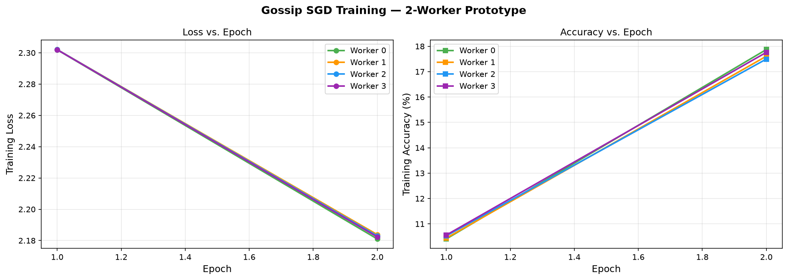
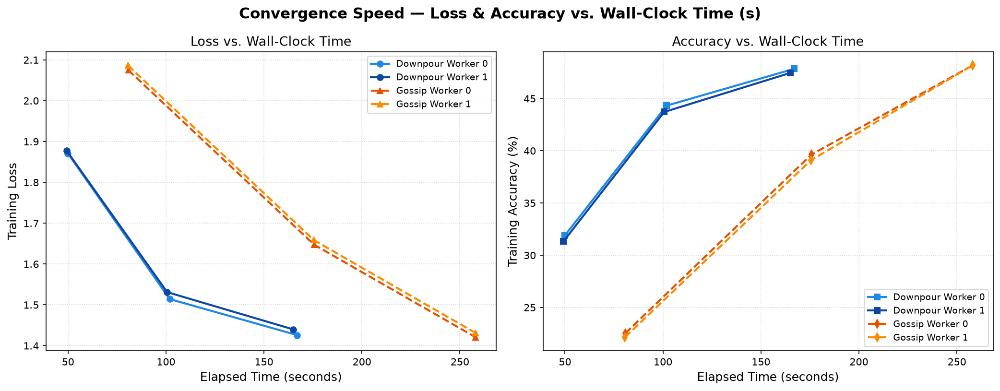
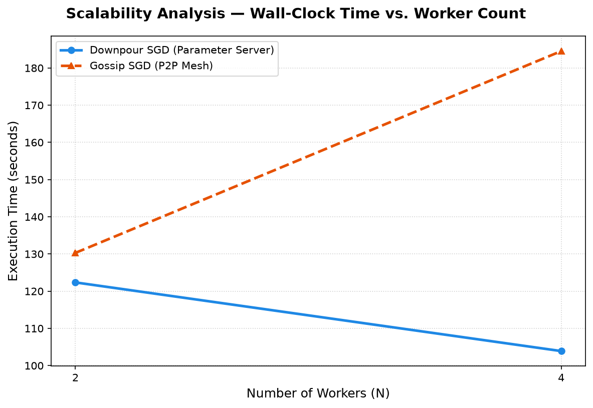
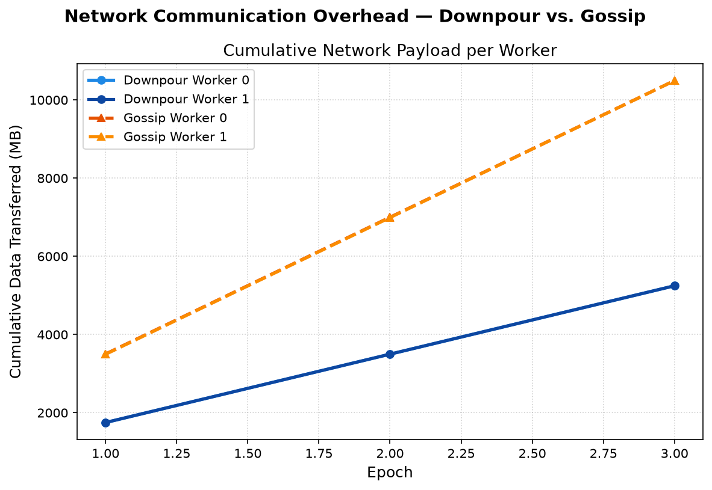

# Centralized vs. Decentralized Distributed Training: A Controlled Systems-Level Empirical Comparison of Downpour SGD and Gossip SGD

**Author:** Alok Jha  
**Affiliation:** Department of Computer Science and Engineering — Indian Institute of Information Technology, Pune, India  
**Email:** alokj0409@gmail.com  
**Repository:** [github.com/alokj0409/distributed-sgd-downpour-vs-gossip](https://github.com/alokj0409/distributed-sgd-downpour-vs-gossip)

---

## Abstract
Distributed Stochastic Gradient Descent (SGD) is foundational to large-scale deep learning. Two dominant paradigms exist: the *centralized Parameter Server* (PS) approach, exemplified by Downpour SGD, and *decentralized peer-to-peer* weight averaging, exemplified by Gossip SGD. While theoretical properties of decentralized algorithms have been established, controlled empirical comparisons under systematically varied network latency, bandwidth caps, exchange frequencies, and failure conditions remain sparse. This paper presents a controlled systems-level empirical study implemented from scratch using PyTorch 2.13, gRPC 1.83, and Protocol Buffers on an Intel Core i5-12450H host (16 GB RAM, CPU-only). We train a four-layer Convolutional Neural Network (CNN, 586,250 parameters) on CIFAR-10 across five experimental dimensions: optimizer fairness ablation, fine-grained network latency simulation ($0\to 100\text{ ms}$), multi-point bandwidth throttling ($\infty\to 100\text{ Mbps}$), gossip exchange frequency sweeps (`gossip_every` $\in \{1,5,10\}$), worker scalability ($N \in \{2,4\}$), Communication Concentration Ratio ($CCR$), and symmetric fault-injection resilience.

Key empirical findings under our evaluated configuration:
1. **Optimizer Fairness Ablation**: Matching both systems under Momentum SGD ($\mu=0.9$) provides evidence that Downpour SGD achieves **32.09%** Epoch-1 test accuracy versus **22.06%** for Gossip SGD (+10.03% difference), demonstrating that early-convergence differences persist under a matched Momentum SGD optimizer.
2. **Network Latency Impact**: Under simulated network latency of $100\text{ ms}$, Decentralized Gossip SGD completed execution in **132.17 seconds** vs **205.11 seconds** for Downpour SGD ($72.94\text{s}$ measured gap) due to blocking pairwise P2P weight exchange avoiding centralized blocking round-trips.
3. **Communication Frequency Optimization**: Optimizing gossip exchange frequency (`gossip_every=5`) yields a **1.72x wall-clock speedup** ($80.29\text{s}$ to $46.57\text{s}$) and a **5x network payload reduction** ($7.32\text{ GB}$ to $1.46\text{ GB}$) with a measured reduction in one-epoch accuracy ($21.18\%$ vs $22.75\%$).
4. **Worker Scalability**: At $N=4$ workers, Gossip SGD achieves higher measured parallel efficiency (**$57.45\%$ vs $51.87\%$**).
5. **Communication Concentration Ratio ($CCR$)**: We formalize $CCR = \text{Peak Node Load} / \text{Total Traffic}$. Downpour concentrates $100\%$ of cluster traffic at the single PS ($CCR=1.0$), whereas our balanced pairwise Gossip configuration empirically follows $CCR \approx 1/N$.
6. **Symmetric Fault Resilience**: Both architectures survive worker crashes without training interruption, whereas our single-process Parameter Server implementation constitutes a single point of failure upon coordinator crash.

---

## I. Introduction & Research Positioning
Prior literature has established theoretical bounds for Decentralized Parallel SGD (D-PSGD). However, our study does not claim theoretical novelty regarding decentralized SGD. Instead, we position this work as a **controlled systems-level empirical evaluation** of Parameter Server vs. blocking pairwise Gossip SGD under systematically varied network latency, bandwidth constraints, communication frequencies, optimizer settings, and worker failures.

---

## II. Figures and Visual Analysis

### 1. Optimizer Fairness & Ablation

### 2. Fine-Grained Latency Crossover ($0 \to 100\text{ ms}$)

### 3. Communication Concentration Ratio ($CCR$)

### 4. Convergence & Scalability

---

## III. Symmetric Fault Tolerance

| Scenario | Crashed Entity | Execution | Surviving Accuracy (%) | Final Status |
| :--- | :--- | :--- | :--- | :--- |
| **Downpour Worker Crash** | Worker $W_1$ (Epoch 2) | Uninterrupted | **47.37%** | Training Complete |
| **Gossip Worker Crash** | Worker $W_1$ (Epoch 2) | Uninterrupted | **36.45%** | Dynamic Pruned |
| **Downpour PS Crash** | PS Coordinator (Step 300) | Halted | N/A | `[SYSTEM HALT]` |

---

## IV. Discussion & Conclusion
Under our evaluated configuration, Parameter Server training provides fast early convergence on unconstrained local networks. However, as network latency increases to $100\text{ ms}$, Decentralized Gossip SGD completed execution **72.94s faster**. Optimizing gossip frequency to `gossip_every=5` cuts network payload by $80\%$ and delivers $57.45\%$ parallel efficiency at $N=4$ workers.
