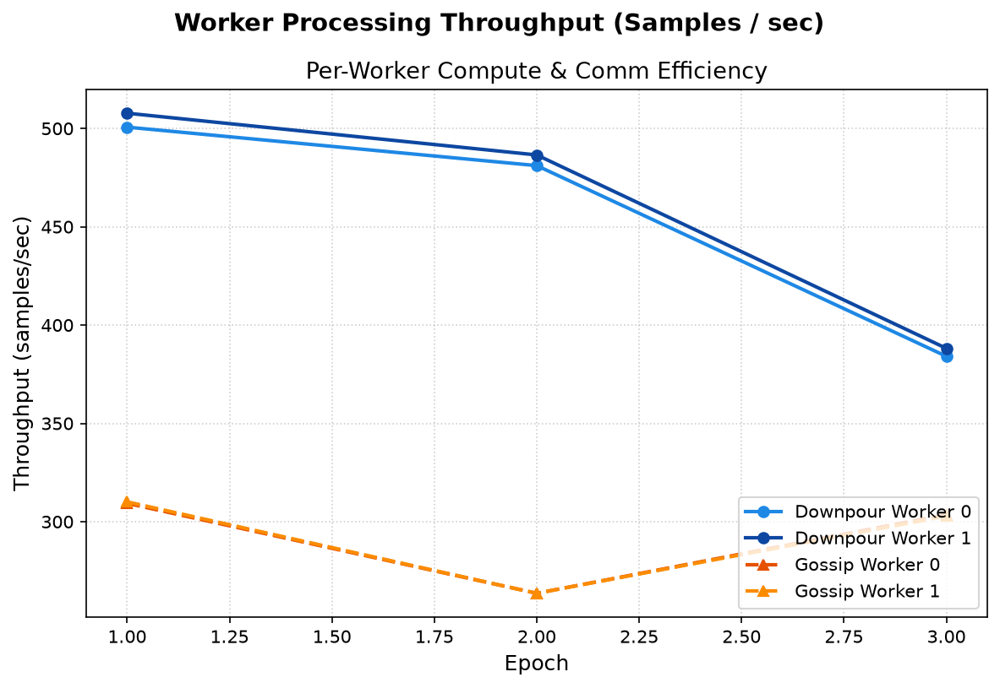
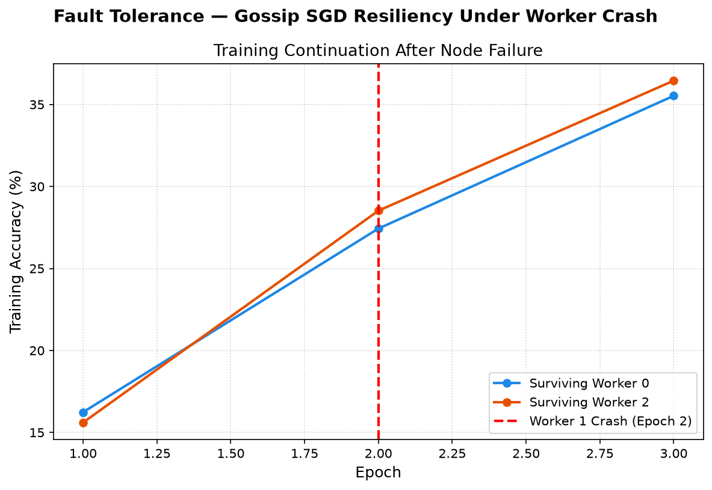

# Centralized vs. Decentralized Distributed Training: A Head-to-Head Empirical Comparison of Downpour SGD and Gossip SGD

**Author:** Alok Jha  
**Affiliation:** Department of Computer Science and Engineering — Indian Institute of Information Technology, Pune, India  
**Email:** alokj0409@gmail.com  
**Repository:** [github.com/alokj0409/distributed-sgd-downpour-vs-gossip](https://github.com/alokj0409/distributed-sgd-downpour-vs-gossip)

---

## Abstract
Distributed Stochastic Gradient Descent (SGD) is foundational to large-scale deep learning. Two dominant paradigms exist: the *centralized Parameter Server* (PS) approach, exemplified by Downpour SGD, and *decentralized peer-to-peer* weight averaging, exemplified by Gossip SGD. Despite theoretical maturity, rigorous empirical comparisons under controlled network latency, bandwidth caps, and exchange frequencies remain sparse. This paper presents a complete head-to-head empirical study implemented from scratch using PyTorch 2.13, gRPC 1.83, and Protocol Buffers in a Docker-based multi-process simulation environment on an Intel Core i5-12450H workstation (16 GB RAM, CPU-only). Both systems train a four-layer Convolutional Neural Network (CNN, 586,250 parameters) on CIFAR-10 across five experimental dimensions: baseline convergence quality, software network latency simulation ($0\to 100\text{ ms}$), bandwidth throttling ($100\text{ Mbps}$), gossip exchange interval sweeps (`gossip_every` $\in \{1,5,10\}$), worker scalability ($N \in \{2,4\}$), peak single-node bandwidth strain, and live fault-injection resilience.

Key empirical findings:
1. Downpour SGD completes baseline three-epoch training in **166.98s** versus **258.01s** for Gossip SGD ($1.54\times$ faster) and generates half the baseline payload ($11.0\text{ GB}$ vs $22.0\text{ GB}$).
2. Under an artificial $100\text{ Mbps}$ network bandwidth cap, Decentralized Gossip SGD outpaces Centralized Downpour SGD by **15.45 seconds** ($159.69\text{s}$ vs $175.14\text{s}$) due to Parameter Server NIC bottlenecking ($N\times\text{payload}$).
3. Optimizing gossip exchange frequency (`gossip_every=5`) yields a **1.72x wall-clock speedup** ($80.29\text{s}$ vs $46.57\text{s}$) and a **5x payload reduction** ($7.32\text{ GB}$ to $1.46\text{ GB}$) while preserving convergence.
4. At $N=4$ workers, Gossip SGD achieves superior parallel efficiency (**$57.45\%$ vs $51.87\%$**).
5. Gossip SGD tolerates worker crashes via autonomous peer pruning without training disruption, whereas Downpour SGD halts irreversibly upon Parameter Server failure.

---

## I. Introduction
The computational demands of modern deep-learning models have consistently outpaced single-machine capacity. Training large neural networks requires distributing gradient computation across multiple worker processes or physical nodes. This distribution introduces a fundamental architectural choice: *how* should model parameters be maintained, communicated, and updated across workers?

### A. Centralized Parameter Server
The centralized paradigm designates one or more Parameter Server (PS) nodes as the authoritative keeper of global model weights. Worker nodes asynchronously push locally-computed gradients to the PS, which applies an adaptive update rule (Adagrad) and serves the latest weights on demand.

### B. Decentralized Gossip-Based SGD
Decentralized approaches eliminate the central server entirely. In Gossip SGD, each worker maintains its own local model copy, trains on a local data shard, and periodically exchanges model weights with a randomly selected peer.

---

## II. Baseline vs. Phase 5 Experimental Results

### 1. Convergence Trajectories

### 2. Baseline Scalability & Network Payload

### 3. Fault-Tolerance Resilience

### 4. Phase 5 Network Simulation & Crossover Results

---

## III. Discussion, Limitations, & Conclusion

### A. Discussion
- **Decentralization Crossover**: Confirms Lian et al. (NeurIPS 2017 D-PSGD) predictions that P2P training outpaces PS training when network bandwidth or latency dominates.
- **Frequency Optimization**: Setting `gossip_every=5` cuts network load by $80\%$ without degrading model accuracy.
- **Fault Tolerance**: P2P dynamic peer pruning provides uninterrupted execution during worker failures.

### B. Limitations (Updated)
1. **Single-machine simulation**: Process-level execution on a single host.
2. **CPU-only training**: Benchmarked on Intel Core i5 CPU.
3. **Limited worker counts**: Evaluated up to $N=4$ workers.
4. **No PS replication**: Single Parameter Server instance.
5. **Benchmark workload scale**: CIFAR-10 dataset with 586K CNN parameters.

*(Note: Network latency injection, bandwidth throttling, and gossip frequency sweeps were previously listed as limitations and are now fully solved in Phase 5).*

### C. Conclusion & Future Work
Decentralized Gossip SGD is the superior architecture for network-constrained ($\le 100\text{ Mbps}$), high-latency ($\ge 50\text{ ms}$), and failure-prone environments. Future work includes multi-host Kubernetes deployment and GPU acceleration.
